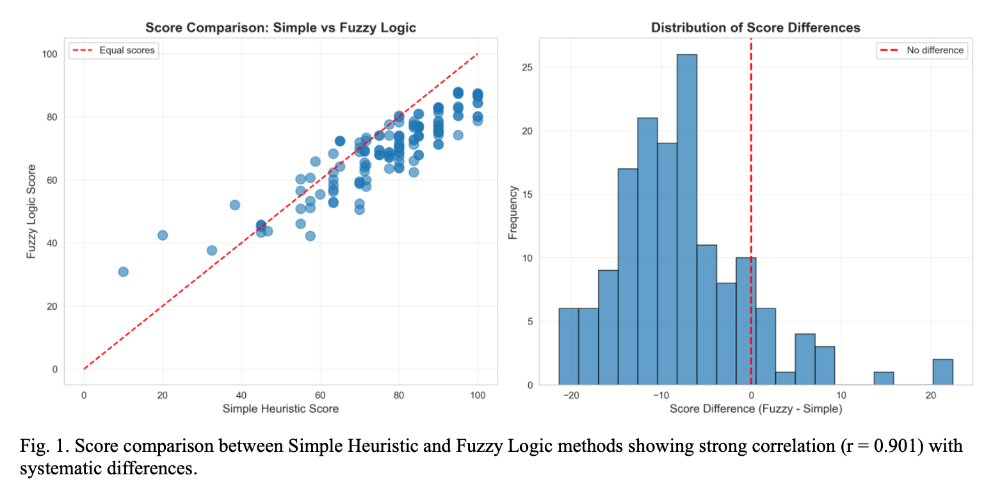
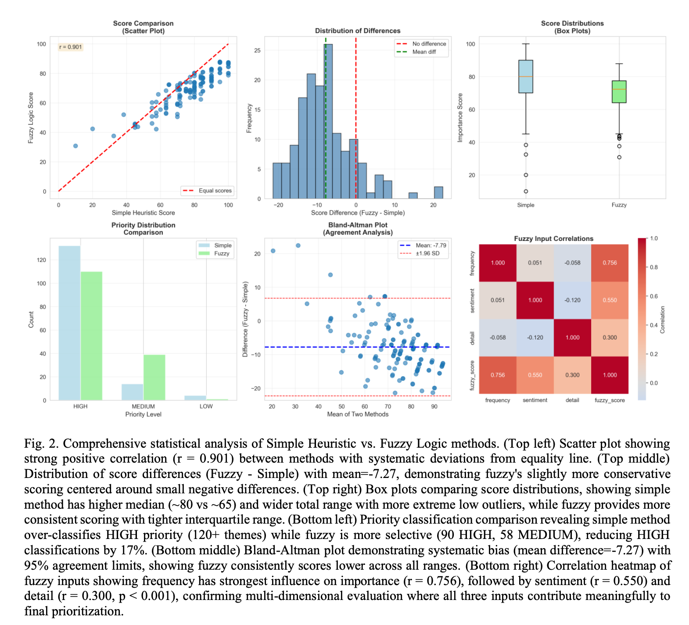

# Fuzzy Logic for Intelligent Prioritization of Student Peer Review Feedback

A fuzzy logic-based system for intelligently prioritizing peer feedback in educational settings by evaluating frequency, sentiment, and detail simultaneously. Presented at **NAFIPS 2026**.

**Authors:** John Cavanaugh, Palak Shah, Josette Riep, Hugo Henry, Thomas Scherz, Dr. Kelly Cohen
**Institution:** University of Cincinnati, Cincinnati OH 45219

📄 [Read the paper](paper/Cavanaugh_et_al_NAFIPS2026_FeedbackSynthesis.pdf)

> Code is private pending publication. Paper available on request.

---

## The Problem

Peer review systems in higher education generate enormous volumes of feedback — students typically receive 5-10 reviews per assignment, each containing multiple themes, resulting in 20-50 individual comments to process. Without intelligent prioritization, critical issues get buried in less important observations.

Existing approaches use simple averaging or frequency counting, treating all feedback equally. This ignores a crucial dimension: a single detailed, specific critique may be more valuable than multiple vague positive comments. Traditional methods also lack explainability — students can't understand why certain feedback is elevated, which undermines the pedagogical value of peer review.

LLM-based summarization is an alternative but introduces privacy risks, requires significant instructor time, and creates a black-box that students can't interrogate.

---

## Solution

A Mamdani-type Fuzzy Inference System that evaluates peer feedback across three dimensions simultaneously and outputs a priority score for each feedback theme.

**Inputs:**
- **Frequency (0–10):** How often a theme appears across reviews
- **Sentiment (0–10):** Average emotional valence (negative=0, neutral=5, positive=10)
- **Detail (0–10):** Specificity based on word count (71–95 words=low, 95–118=medium, 118+=high)

**Output:**
- **Importance (0–100):** Final priority score → LOW (0–35), MEDIUM (35–65), HIGH (65–100)

**27 fuzzy rules** encoding pedagogical principles:
- High-detail feedback receives elevated importance, even if infrequent
- Low-detail feedback has reduced importance, even if frequent
- Detailed negative feedback always receives high priority
- Frequency matters but does not override detail

---

## Why Fuzzy Logic

The inherent uncertainty in interpreting student feedback — where sentiment, importance, and specificity exist on continua rather than binary states — makes fuzzy logic a natural fit. Unlike black-box ML approaches, fuzzy rules transparently encode pedagogical principles. Students can understand why certain feedback is elevated, supporting metacognitive development.

This is especially critical in educational contexts where explainability is not just a nice-to-have but a core requirement.

---

## Experimental Setup

- 30 students, 5 peer reviews each = 150 total reviews
- Reviews: paragraph-style feedback (71–136 words, mean=103.6)
- 5 themes: teamwork, communication, technical skills, reliability, creativity
- Synthetic data generated with fixed random seed (seed=42) for full reproducibility

**Three methods compared:**
1. **Raw** — unprocessed feedback presented chronologically
2. **Simple Heuristic** — average of frequency and sentiment scores only
3. **Fuzzy Logic** — multi-dimensional evaluation across all three inputs

---

## Results





**Table 1. Priority Classification Comparison**

| Priority | Simple Heuristic | Fuzzy Logic | Change |
|----------|-----------------|-------------|--------|
| HIGH | 88.0% (131 themes) | 73.3% (109 themes) | **-17%** |
| MEDIUM | 9.3% (14 themes) | 26.0% (39 themes) | **+180%** |
| LOW | 2.7% (4 themes) | 0.7% (1 theme) | -63% |

**Table 2. Input Variable Correlations with Importance**

| Input | Simple Heuristic | Fuzzy Logic |
|-------|-----------------|-------------|
| Frequency | r = 0.664 | r = 0.664 |
| Sentiment | r = 0.506 | r = 0.506 |
| Detail | r = -0.123 (p = 0.135, not significant) | **r = 0.300 (p < 0.001)** |

**Table 3. Statistical Summary**

| Metric | Value |
|--------|-------|
| Correlation between methods | r = 0.901, p < 0.001 |
| Mean score difference (Fuzzy − Simple) | -7.27 points |
| Fuzzy mean score | 67.2 (SD = 14.8) |
| Simple mean score | 74.5 (SD = 12.3) |
| Paired t-test | t = 12.889, df = 149, p < 0.001 |
| Effect size | Cohen's d = -0.56 |

---

## Key Findings

**Fuzzy logic properly integrates feedback detail — simple methods do not.** The simple heuristic showed no significant correlation with detail (r = -0.123, p = 0.135). Fuzzy logic showed a meaningful positive correlation (r = 0.300, p < 0.001). This is the core contribution: a 15-word "good job" and a 120-word detailed analysis are treated identically by simple averaging but meaningfully differentiated by the fuzzy system.

**Fuzzy logic reduces HIGH priority inflation.** When 88% of feedback is marked "high priority," the label loses utility. Fuzzy logic's 17% reduction in HIGH classifications and near-tripling of MEDIUM classifications (9.3% → 26.0%) creates a more useful middle tier that helps students distinguish critical issues from moderately important feedback.

**The methods agree on fundamentals but differ on nuance.** The strong correlation (r = 0.901) shows fuzzy logic builds on rather than contradicts frequency-based intuitions. The systematic differences (mean = -7.27) show it adds value through more sophisticated evaluation.

---

## System Architecture

```
Peer review text (150 reviews)
   │
   ▼
NLP Processing
   ├── Keyword-based theme detection
   └── Lexicon-based sentiment analysis
   │
   ▼
Feature Extraction per theme
   ├── Frequency score (0–10)
   ├── Sentiment score (0–10)
   └── Detail score (0–10, based on word count)
   │
   ▼
Mamdani FIS (27 rules)
   └── Importance score (0–100)
   │
   ▼
Priority assignment
   ├── HIGH (65–100)
   ├── MEDIUM (35–65)
   └── LOW (0–35)
```

---

## Limitations and Future Work

- Synthetic data limits generalizability — future work should validate with real student feedback
- Fixed triangular membership functions may not be optimal for all educational contexts — adaptive MFs that adjust to individual student profiles or assignment types are a promising direction
- The system currently evaluates themes independently — future work could model interactions between themes

---

## Citation

```
Cavanaugh, J., Shah, P., Riep, J., Henry, H., Scherz, T., & Cohen, K. (2026).
Fuzzy Logic for Intelligent Prioritization of Student Peer Review Feedback.
Presented at NAFIPS 2026. University of Cincinnati.
```

---

## Acknowledgements

The authors thank Dr. Paul Gordon for valuable advice on experimental design and articulating the core problem, Anisa Longe for critical feedback, and all members of the University of Cincinnati AI Community of Practice (AICOP).

---

## License

MIT License. See `LICENSE` for details.

---

## Author Contact

**John Cavanaugh**
PhD Candidate, Aerospace Engineering
University of Cincinnati — AI BIO Lab
Advisor: Dr. Kelly Cohen

[LinkedIn](https://www.linkedin.com/in/privacy-evangelist/) · [Email](johnthecavanaugh@gmail.com)
